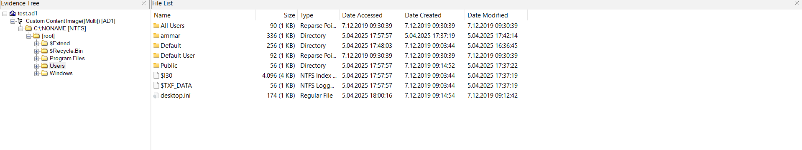
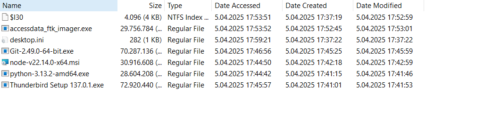
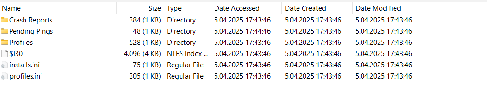
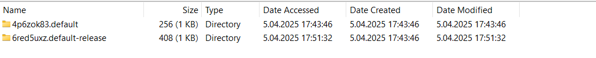
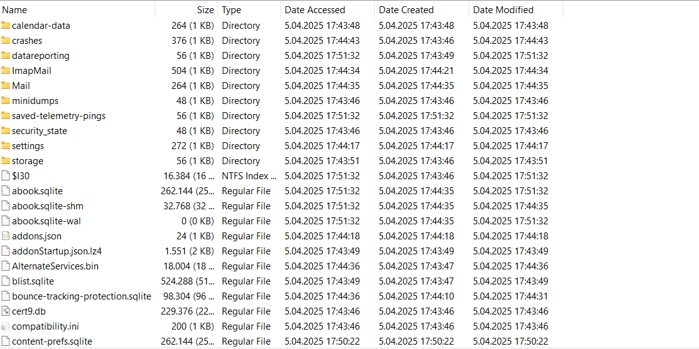
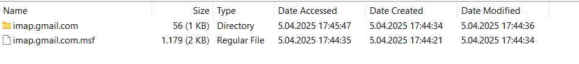

# Adli Bilişim Uzmanı 1

**Challenge:** Adli Bilişim Uzmanı  
**Kategori:** Forensics (Adli Bilişim)  
**Seviye:** Orta

## Hazırlık

Öncelikle **FTK Imager** uygulamasını kurmamız gerekmektedir.

> **Not:** FTK Imager uygulamasını kurarken şirket maili istenmektedir. Şirket mailini bypass yapabilmek için *tempmail* kullanabilirsiniz.

İndirdikten sonra:
1. `File > Add Evidence Item > Image File` 
2. `test.ad` dosyasını seçin.

## 1. Flag: E-posta Analizi

İmaj dosyasını açtıktan sonra `Users` klasörüne girdiğimizde bizi şu görüntü karşılıyor:



Buradan `ammar` kullanıcısının klasörüne giriyoruz.

Ammar klasörüne girdikten sonra ilk olarak `Downloads` (İndirilenler) klasörünü kontrol etmemiz gerekir. Çünkü virüsler genellikle bir dosya indirilip çalıştırıldığında bulaşır.

`Downloads` klasörüne girdiğimizde şu dosyalarla karşılaşıyoruz:



Burada şüpheli olan dosya:
**Thunderbird Setup 137.0.1.exe** - ⚠️ THUNDERBIRD EMAIL CLIENT! (Bu bir e-posta istemcisidir.)

Ardından `AppData` klasörüne gitmemiz lazım. Uygulama verilerinin kayıt olduğu yer genellikle burasıdır.
Yol: `Users > ammar > AppData > Roaming > ThunderBird`

Bizi 3 klasör karşılıyor:



`Profiles` klasörüne girmemiz gerekiyor, çünkü e-postalar orada tutulur.

`Profiles` klasörüne girdiğimizde 2 adet klasör görüyoruz:



*   **default-release:** Aktif profil, e-postalar burada bulunur.
*   **default:** Genellikle boş veya eski profildir.

`default-release` klasörüne giriyoruz.



Ardından `ImapMail` klasörünü açıyoruz. E-postalar burada tutuluyor.



İçeri girdiğimizde `[Gmail].sbd` klasörü ve `INBOX` dosyası var.

`INBOX` dosyasını export ediyoruz (dışarı aktarıyoruz). Herhangi bir metin editörü veya e-posta görüntüleyici ile açabilirsiniz.

Ve 1. flag'i bulduk!

```text
PitoCtf{ammar55221133@gmail.com_masmoudim522@gmail.com}
```

*(Analiz kısmı yapay zeka ile yaptım.)*

## 2. Flag: Zararlı Yazılım Analizi (Link Tespiti)

2. flag için bizden istenen: `Pitoctf{SaldırganınMalwareBulaştırmakİçinKullandığıLink}`.

İlk başta mailde bir GitHub adresi var, onu denedim ama yanlış çıktı. Ardından GitHub'dan dosyaları indirdim. İndirdiğimizde 4 dosya var:
*   `index.js`
*   `package-lock.json`
*   `package.json`
*   `proc.js`

`proc.js` dosyasını incelediğimizde (yapay zeka desteğiyle), Base64 ile şifrelenmiş bir metin bulundu. Decode edince bizi zararlı yazılımın linki karşıladı.

Ve 2. flag:

```text
Pitoctf{https://tmpfiles.org/dl/23860773/sys.exe}
```

## 3. Flag: C2 Sunucusu Tespiti

3. flag için bizden istenen: `Pitoctf{MalwareC2ServerAdresindenYaptığıİlkİstek}`.

2. sorunun flag'ini ararken yanlışlıkla birkaç dosya buldum.
`ammar > Documents` (Belgeler) içinde `sys.exe` dosyası var. Bu dosya, bulduğumuz linkteki dosya ile aynı!

Dosyayı export ettim ve Kali Linux'a aktardım.
Daha sonra VirusTotal'de aratmak için öncelikle SHA256 hash'ini buldum.

```bash
sha256sum sys.exe
# Çıktı: be4f01b3d537b17c5ba7dc1bb7cd4078251364398565a0ca1e96982cff820b6d  sys.exe
```

Ardından SHA256 Hash'i VirusTotal'e yapıştırdım ve çıkan sonuç ile linkteki dosya aynı!

"Behavior" yerine geçtim. Burada dosyanın yaptığı tüm istekler ve aktiviteler listeleniyor.

**Shell Commands:**
```text
%SAMPLEPATH%
"C:\Program Files (x86)\Microsoft\EdgeUpdate\MicrosoftEdgeUpdate.exe" /svc
C:\Windows\System32\svchost.exe -k LocalSystemNetworkRestricted -p -s StorSvc
...
cmd /C powershell -ExecutionPolicy Bypass -File create_shortcut.ps1 -targetPath "C:\Users\<USER>\Desktop\sys.exe" ...
```

**Network Communication (HTTP requests):**
```text
GET http://40.113.161.85:5000/heartbeat
GET http://40.113.161.85:5000/helppppiscofebabe23
GET http://40.113.161.85:5000/tasks
POST http://40.113.161.85:5000/config
POST http://40.113.161.85:5000/login
```

Ve C2 SERVER'ı bulduk!
**C2 Server:** `http://40.113.161.85:5000`

İstenen flag formatına uygun olan ilk istek:

```text
Pitoctf{http://40.113.161.85:5000/helppppiscofebabe23}
```

## 4. Flag: Token Analizi

4. Yani son flagı bulmak için:

### Adım 1: HTTP Header Pattern'lerini Ara

Önce standart Authorization header yapısını arıyoruz:

```bash
strings sys.exe | grep -i "authorization" -A5 -B5
```

Çıktı içinde `Authorization` header ismi görünüyor.

```bash
strings sys.exe | grep -i "bearer" -A5 -B5
```

Çıktı:
```text
Bearer unknownhttp://
```
"Bearer unknown" ifadesi var ama bu gerçek token değil, muhtemelen bir hata mesajı veya yer tutucu.

### Adım 2: JSON Struct'larını İncele

Go malware'inde authentication genellikle JSON struct'ları ile yapılır:

```bash
strings sys.exe | grep -i "token"
```

Çıktı:
```go
6*struct { AccessToken string "json:\"access_token\"" }
```
Malware bir `AccessToken` alanı kullanıyor.

### Adım 3: Hardcoded Token'ları Ara

Token genellikle 32-64 karakter uzunluğunda hex string olur:

```bash
strings sys.exe | grep -E "^[A-Za-z0-9]{32,64}$" | head -20
```

Çıktı:
```text
panamakakbmbgbkcalpfnfmgkghzmldlklfmnmmmcmkmm2m3m
kgdbgyhahpinkkktlmlnlxphprsrsvwbv
EDDDDDDDDDDDDDDDDDDDDDDDDDDDDDDD
DDDDDDDDDDDDDDDDDDDDDDDDDDDDDDDD
UUUUUUUUUUUUUUUUUUUUUUUUUUUUUUUUUUUUUUUUUUUUUUUUUUUUUUUUUUUUUUUU
e7bcc0ba5fb1dc9cc09460baaa2a6986
```

### Adım 4: Token'ı Filtrele

Bulunan string'leri analiz ediyoruz:

| String | Analiz | Token mu? |
|--------|--------|-----------|
| `panamakak...` | Anlamsız karakter dizisi | ❌ |
| `kgdbgyha...` | Anlamsız karakter dizisi | ❌ |
| `EDDDD...` | Tekrar eden 'D' karakteri | ❌ |
| `UUUUU...` | Tekrar eden 'U' karakteri | ❌ |
| `e7bcc0ba5fb1dc9cc09460baaa2a6986` | **32 char hex string** | ✅ |

**`e7bcc0ba5fb1dc9cc09460baaa2a6986`** tipik bir API token formatıdır:
- 32 karakter uzunluğunda
- Sadece hexadecimal karakterler (0-9, a-f)
- MD5 hash formatına uyuyor

### Sonuç

```text
Pitoctf{e7bcc0ba5fb1dc9cc09460baaa2a6986}
```

---

## Kullanılan Komutlar (Özet)

```bash
# Authorization header ara
strings sys.exe | grep -i "bearer"

# JSON struct ara
strings sys.exe | grep "access_token"

# 32-64 char token ara
strings sys.exe | grep -E "^[A-Za-z0-9]{32,64}$"
```

