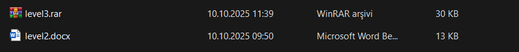
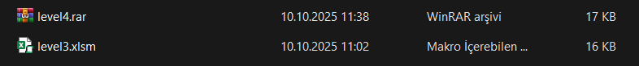
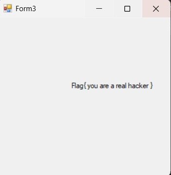

# CTF Write-up: Level 1–4

> TL;DR 🚀: Gizli metinleri ortaya çıkardık, Office belgelerindeki makroları statik analiz ettik, bozuk dosyayı hex ile düzelttik ve son olarak reverse engineering ile flag’e ulaştık. 🎯


## Özet
Bu çalışma; arşiv şifrelerini ipuçlarıyla çözme, Word/Excel belgelerinde saklı içerikleri ve makroları açığa çıkarma, binary/hex müdahalesi ile bozuk dosyayı onarma ve temel reverse engineering adımlarıyla sonuca ulaşma sürecini anlatır. 🔍 ➡️ 🧩 ➡️ 🏁

## Ekran Görüntüleri
Aşağıdaki görselleri `resimler/` klasöründen referanslayabilirsiniz. Yol ve dosya adlarının birebir eşleştiğinden emin olun.

```md






```

## Adım Adım Kısa Akış
- Word belgesinde gizli yazı: tüm metni seçip görünür renk ile ortaya çıkarma. ✍️
- İpucuyla arşivi açma: ipucu string’lerini bularak RAR/ZIP’i çözme. 🔑
- Excel makro analizi: `.xlsm` arşivini açıp `vbaProject.bin` içinde `strings` ile ipucu/şifre arama. 🧠
- Bozuk dosyayı düzeltme: hex ile ilk byte’ı `FF` yapıp görüntüyü açılır hale getirme. 🧰
- QR ve reverse: QR’dan gelen exe’yi GHidra/dnSpy ile inceleyip kontrol akışını çözme. 🧪

## Detaylı Yazı
Tüm ayrıntılı adımlar için: [cozum.md](./cozum.md)

