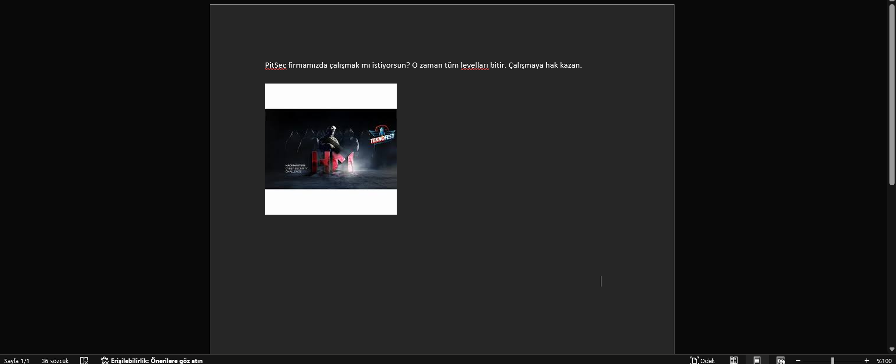
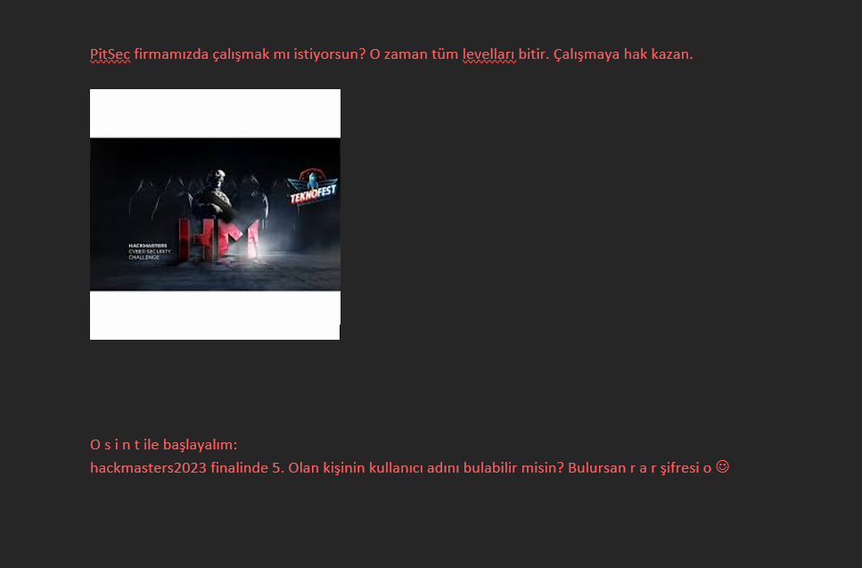
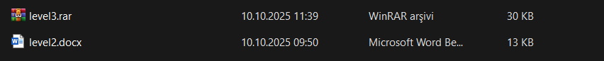
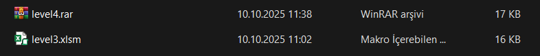
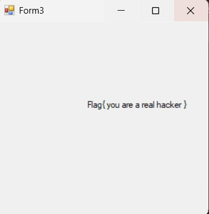

**Mülakat** WRİTEUP

> TL;DR 🚀: Gizli metinleri ortaya çıkarıp ipuçlarını takip ederek arşivleri açtık, Office belgelerinde saklı içerikleri çıkardık, makro kodlarını statik analiz ettik, bozuk dosyayı hex ile düzelttik ve reverse engineering adımıyla son flag’e ulaştık. 🎯

Öncelikle Dosyayı İndiriyoruz, dosyayı indirip rardan çıkartıyoruz.

2 Adet Dosya var elimizde.

Bunların biri .rar uzantılı, diğeri .docx uzantılı. '.docx' uzantılı dosyalar Word oluyor. Word ile açtığımızda



Burada dikkatimizi çeken sol alttada yazdığı gibi 36 sözcük yazması. Büyük ihtimalle yazılan metin, beyaz renkte.

CTRL+A yaparak, tüm hepsini seçiyoruz, ardından rengi değiştiriyoruz.

Sonuç:



Öncelikle okulun sitesine gidiyoruz. Sitesine gidip, haberlerde ve duyurularda arattığımızda herhangi bir çıktı gelmiyor karşımıza.

Okulun Ana Sayfasından Başarılarımız kısmında, siber güvenlik alanı var. Oraya giriyoruz, bizi bir video karşılıyor.

Videonun tam 1:17'inci saniyesinde Scoreboard'da 5. olan Cihan Hocam'ızın nickname'ine ulaşıyoruz.

Ardından RAR dosyasına şifreyi girerek RAR'ı açıyoruz. Klasöre çıkarttığımızda iki dosya oluyor.



Word dosyasını açıyoruz. 

“Hiçbir sorumuzda rockyou kullanmadık. Gerçekten. Boşa zaman kaybetme.”

böyle diyor. 

RAR dosyasının şifreli olduğunu görüyoruz. "Hiçbir sorumuzda rockyou kullanmadık. Gerçekten. Boşa zaman kaybetme." bu ipucuyu aklımızda tutalım.

Burada *yapay zekadan* yardım alarak:
```bash
unzip level2.docx -d level2_extracted
```

ilk başta dosyayı unzip yapıyoruz.

Ana document içeriğini oku:
```bash
cat level2_extracted/word/document.xml
```

Gizli text, yorumlar, vs. ara:
```bash
find level2_extracted -name "*.xml" -exec cat {} \; | grep -i "password\|pass\|hint\|flag\|key"
```

Tüm metin içeriğini düzgün formatta göster:
```bash
python3 << 'EOF'
import zipfile
import xml.etree.ElementTree as ET

with zipfile.ZipFile('level2.docx', 'r') as zip_ref:
    xml_content = zip_ref.read('word/document.xml')
    
# Namespace'i kaldır ve text'i çıkar
root = ET.fromstring(xml_content)
for elem in root.iter():
    if elem.text:
        print(elem.text)
EOF
```

Uzuuunca bir çıktı elde ediyoruz:
```bash
Archive:  level2.docx
  inflating: level2_extracted/[Content_Types].xml  
  inflating: level2_extracted/_rels/.rels  
  inflating: level2_extracted/word/_rels/document.xml.rels  
  inflating: level2_extracted/word/theme/theme1.xml  
  inflating: level2_extracted/word/settings.xml  
  inflating: level2_extracted/word/webSettings.xml  
  inflating: level2_extracted/word/stylesWithEffects.xml  
  inflating: level2_extracted/docProps/core.xml  
  inflating: level2_extracted/word/styles.xml  
  inflating: level2_extracted/word/fontTable.xml  
  inflating: level2_extracted/docProps/app.xml  
  inflating: level2_extracted/word/document.xml  
<?xml version="1.0" encoding="UTF-8" standalone="yes"?>
<w:document xmlns:wpc="http://schemas.microsoft.com/office/word/2010/wordprocessingCanvas" xmlns:mc="http://schemas.openxmlformats.org/markup-compatibility/2006" xmlns:o="urn:schemas-microsoft-com:office:office" xmlns:r="http://schemas.openxmlformats.org/officeDocument/2006/relationships" xmlns:m="http://schemas.openxmlformats.org/officeDocument/2006/math" xmlns:v="urn:schemas-microsoft-com:vml" xmlns:wp14="http://schemas.microsoft.com/office/word/2010/wordprocessingDrawing" xmlns:wp="http://schemas.openxmlformats.org/drawingml/2006/wordprocessingDrawing" xmlns:w10="urn:schemas-microsoft-com:office:word" xmlns:w="http://schemas.openxmlformats.org/wordprocessingml/2006/main" xmlns:w14="http://schemas.microsoft.com/office/word/2010/wordml" xmlns:wpg="http://schemas.microsoft.com/office/word/2010/wordprocessingGroup" xmlns:wpi="http://schemas.microsoft.com/office/word/2010/wordprocessingInk" xmlns:wne="http://schemas.microsoft.com/office/word/2006/wordml" xmlns:wps="http://schemas.microsoft.com/office/word/2010/wordprocessingShape" mc:Ignorable="w14 wp14"><w:body><w:p w:rsidR="00166D34" w:rsidRDefault="008830E5"><w:r><w:t xml:space="preserve">Hiçbir sorumuzda </w:t></w:r><w:proofErr w:type="spellStart"/><w:r><w:t>rockyou</w:t></w:r><w:proofErr w:type="spellEnd"/><w:r><w:t xml:space="preserve"> kullanmadık.</w:t></w:r><w:r w:rsidR="00C17CD2"><w:t xml:space="preserve"> Gerçekten. Boşa zaman kaybetme.</w:t></w:r><w:bookmarkStart w:id="0" w:name="_GoBack"/><w:bookmarkEnd w:id="0"/></w:p><w:sectPr w:rsidR="00166D34"><w:pgSz w:w="11906" w:h="16838"/><w:pgMar w:top="1417" w:right="1417" w:bottom="1417" w:left="1417" w:header="708" w:footer="708" w:gutter="0"/><w:cols w:space="708"/><w:docGrid w:linePitch="360"/></w:sectPr><!--  sifremiz:abce1286Fnmg!aaRfKCstugASX  --></w:body></w:document><cp:coreProperties xmlns:cp="http://schemas.openxmlformats.org/package/2006/metadata/core-properties" xmlns:dc="http://purl.org/dc/elements/1.1/" xmlns:dcterms="http://purl.org/dc/terms/" xmlns:dcmitype="http://purl.org/dc/dcmitype/" xmlns:xsi="http://www.w3.org/2001/XMLSchema-instance"><dc:title></dc:title><dc:subject></dc:subject><dc:creator>ThoR</dc:creator><cp:keywords></cp:keywords><dc:description></dc:description><cp:lastModifiedBy>ThoR</cp:lastModifiedBy><cp:revision>3</cp:revision><dcterms:created xsi:type="dcterms:W3CDTF">2025-10-10T06:48:00Z</dcterms:created><dcterms:modified xsi:type="dcterms:W3CDTF">2025-10-10T06:48:00Z</dcterms:modified></cp:coreProperties><?xml version="1.0" encoding="UTF-8" standalone="yes"?>
Hiçbir sorumuzda 
rockyou
 kullanmadık.
 Gerçekten. Boşa zaman kaybetme.
```

Biraz inceledikten sonra, <!--  sifremiz:abce1286Fnmg!aaRfKCstugASX  --> böyle bir yorum satırı olacağını fark edeceksiniz.
Vee taadaaa! şifreyi bulduk, hemen zip'ten çıkarıyoruz level 3'e geçiyoruz.

Level 3'ü RAR'dan çıkardık. İki adet dosya var. Gene Level 4.rar ve bir excel dosyası.
Excel dosyasını açıyoruz. 


yazanlar bunlar. 

Şimdi Excel dosyasını gene zip şeklinde çıkartıyoruz:
```bash
unzip level3.xlsm -d level3_extracted
```

Sonra makro kodunu buluyoruz. Peki esas soru, makro nedir?
**Makro** (Office/Excel/Word bağlamında): Belirli işlemleri otomatikleştirmek için yazılan küçük programlardır. Microsoft Office belgelerinde genelde **VBA (Visual Basic for Applications)** diliyle yazılır ve belge içine gömülü durur.

```bash
find level3_extracted -name "*.bin" -o -name "vbaProject.bin"
```

Makro kodunu strings ile çıkartıyoruz:
```bash
strings level3_extracted/xl/vbaProject.bin | more
```

```bash
$ strings level3_extracted/xl/vbaProject.bin | more
pass:gorunmezsifre
Birinci say girin:
Hesap Makinesi - 1/3$
ikinci say girin:
Hesap Makinesi - 2/3$
Hangi işlemi yapmak istiyorsunuz? (+, -, *, /)
Hesap Makinesi - 3/3
ra bölme hatası
Geçersiz işlem!
Sonuç: Hesap Makinesi
pass:gorunmezsifre
On Error GoTo Handler
InputBox("Birinci say:", "Hesap Makines
```

VEE TA DAA! 4. Levelin şifresinide bulduk.
pass:gorunmezsifre

Hemen RAR dosyasına şifreyi giriyoruz ve bolumsonucanavari adlı bir dosya karşılıyor.

Hemen ilk başta, `file` komutunu giriyoruz.
```bash
file bolumsonucanavarinagidenyol
```
Çıktısı:
```
bolumsonucanavarinagidenyol: data
```

Hemen strings çıktısına bakıyoruz.

"JFIF" olduğunu görüyoruz.

Hemen hexedit ile açıyoruz.
```bash
hexedit bolumsonucanavarinagidenyol
```
Çok uzun bir çıktı çıkıyor.
Hex dump'ı görünce anlıyoruz ki, ilk byte 00 değil, FF olmalı. Hemen yine *yapay zeka* yardımıyla bir Python kodu yazıyoruz 🛠️

```bash
python3 << 'EOF'
with open('bolumsonucanavarinagidenyol', 'rb') as f:
    data = bytearray(f.read())

# İlk byte'ı FF yap
data[0] = 0xFF

with open('resim_duzeltilmis.jpg', 'wb') as f:
    f.write(data)
    
print("Düzeltildi! resim_duzeltilmis.jpg açılabilir olmalı")
EOF
```

```bash
file resim_duzeltilmis.jpg
xdg-open resim_duzeltilmis.jpg
```

VEE TA DA!! 🎉 Bir QR kod çıkıyor. 


QR Kodu okutuyoruz. [crackme99.rar](https://github.com/cihangungor/pitoctf/blob/main/crackme99.rar) gönderiyor.

İndiriyoruz, ve bakıyoruz ki .exe dosyası. Aklımıza direk Reverse geliyor.

İlk başta ben, **GHidra** ile yapay zeka ortak çalıştığından onunla çözmek istedim. Ama olmadı ve bana **dnSpy** önerdi. Ardından onunla açtım. 

İlk açtığımızda bizi: _crackme99.exe.png_ karşılıyor.

Sonra Form1'i inceliyoruz: 
private void button1_Click(object sender, EventArgs e)
{
    Form3 form = new Form3();
    string text = this.textBox1.Text;
    int num = Convert.ToInt32(this.textBox2.Text);

    // KRİTİK KONTROL SATIRI
    bool flag = text == Form1.msj.Substring(0, 4) && num == 99;

    if (flag)
    {
        form.Show();
        base.Hide();
    }
}

Bu kısım dikkatimizi çekiyor. Ve kontrol burada gerçekleşiyor. `num == 99` olduğunda; `Form3` gösteriliyor ve diğer form gizleniyor.

Şart 2: `textBox1`'deki Değer (Gizli Kullanıcı Adı/Şifre)

Koşulun ilk kısmı:
text==Form1.msj.Substring(0,4)

text değişkeni textBox1'den alınan değerdir. Bu değerin, Form1.msj string'inin ilk 4 karakterine eşit olması gerekiyor.

Form1.msj değişkeninin değeri şuydu:
C#

public static string msj = "Flag is not that easy. It might even be a little difficult. If you are a real hacker you can solve it :) : } { :";

Form1.msj.Substring(0, 4) ifadesi, bu string'in 0. indisten başlayarak 4 karakterini alır.

“F l a g is not...” ⟹ **Flag**

Çözüm: `textBox1`'e girilmesi gereken değer **Flag** olmalıdır.

Programı çalıştırıp, giriyoruz. Bizi login yeri karşılıyor.

Kullanıcı adı = `flag`
password = `99`

VEEE FLAGIMIZ BULUNDU! 🏁




